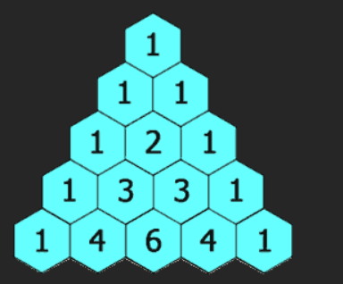

# Two Dimension Array

# Basic

## Print Matrix

```java
public class MatrixPrint {
    public static void main(String[] args) {
        int matrix[][]={{1,2,3},{4,5,6},{7,8,9}};

        int m=matrix.length;
        int n=matrix[0].length;

        for(int i=0; i<m; i++){
            for(int j=0; j<n; j++){
                System.out.print(matrix[i][j]+" ");
            }
            System.out.println();
        }
        
    }
}
```

## Print Matrix in Reverse Order

```java
public class ReverseMatrix {
    public static void main(String[] args) {
        int matrix[][]={{1,2,3},{4,5,6},{7,8,9}};

        int m=matrix.length;
        int n=matrix[0].length;

        for(int i=m-1; i>=0; i--){
            for(int j=0; j<n; j++){
                System.out.print(matrix[i][j]+" ");
            }
            System.out.println();
        }
        
    }
}
```

## Search in Matrix

```java
 public static boolean search(int matrix[][], int key){
        for(int i=0; i<matrix.length; i++){
            for(int j=0; j<matrix[0].length; j++){
                if(matrix[i][j]==key){
                    System.out.println("The Key is found at index("+i+","+j+")");
                    return true;
                }
            }
        }
        System.out.println("Key not found");
        return false;
    }
```

## Transpose of Matrix

```java
public void transpose(int[][] matrix) {
		int n = matrix.length;
    for (int i = 0; i < n; i++) {
        for (int j = i + 1; j < n; j++) {
            // swap elements across diagonal
            int temp = matrix[i][j];
            matrix[i][j] = matrix[j][i];
            matrix[j][i] = temp;
        }
    }
}

```

## Max & Min Number in Matrix

```java
 public static void max(int matrix[][]){
        int max=matrix[0][0];

        for(int i=0; i<matrix.length; i++){
            for(int j=0; j<matrix[0].length; j++){
                if(matrix[i][j]>max){
                    max=matrix[i][j];
                }
            }
        }
        System.out.println("The max no of of the matrix is= "+max);
    }
    
    public static void min(int matrix[][]){
        int min=matrix[0][0];
        for(int i=0; i<matrix.length; i++){
            for(int j=0; j<matrix[0].length; j++){
                if(matrix[i][j]<min){
                    min=matrix[i][j];
                }
            }
        }
        System.out.println("The Min elemnt in the matrix is= "+min);
        
    }
```

## 1. Matrix Diagonal Sum (1572)

**Example 1:**


```
Input: mat = [[1,2,3],
              [4,5,6],
              [7,8,9]]
```

```java
class Solution {
    public int diagonalSum(int[][] mat) {
        int n=mat.length;
        int sum=0;

        for(int i=0; i<n; i++){
            //for primarly diagonal Elements
            sum+=mat[i][i];

            //for Secondary Diagonal Elements
            if(i!=n-i-1){
                sum+=mat[i][n-1-i];
            }
        }
        return sum;
    }
}
```

## 2. Spiral Matrix (54)

**Example 1:**


```
Input: matrix = [[1,2,3],[4,5,6
```

```java
//Time Complexity - O(n*m);
//Space Complexity - O(n*m);

class Solution {
    public List<Integer> spiralOrder(int[][] matrix) {
        int n=matrix.length;      //3
        int m=matrix[0].length;  //4

        int startRow=0;
        int startColumn=0;
        int endRow=n-1;    // 2
        int endColumn=m-1;  //3

        ArrayList<Integer> list=new ArrayList<>();

        while(startRow<=endRow && startColumn<=endColumn){
            for(int j=startColumn; j<=endColumn; j++){
                list.add(matrix[startRow][j]);
            }

            for(int i=startRow+1; i<=endRow; i++){
                list.add(matrix[i][endColumn]);
            }

            if(startRow<endRow){
                for(int j=endColumn-1; j>=startColumn; j--){
                list.add(matrix[endRow][j]);
            }
            }
            
            if(startColumn <endColumn){
                 for(int i=endRow-1; i>=startRow+1; i--){
                list.add(matrix[i][startColumn]);
            }
            }
           

            startRow++;
            startColumn++;
            endRow--;
            endColumn--;
        }
        return list;
    }

}
```

## 3. Rotate Matrix by 90 degree  (48)
      / Rotate Image

**Example 1:**


```
Input: matrix = [[1,2,3],[4,5,6],[7,8,9]]
Output: [[7,4,1],[8,5,2],[9,6,3]]
```

Method 1- Using Extra Temp Matrix

```java
class Solution {
    public void rotate(int[][] matrix) {
        int m=matrix.length;
        int n=matrix[0].length;
        int p=m-1, q=0;

        int temp[][]=new int[m][n];
        for(int i=0; i<m; i++){
        p=m-1;
        for(int j=0; j<n; j++){
            temp[i][j]=matrix[p--][q];
            
        }
        q++;
      }
      

      for(int i=0; i<m; i++){
        for(int j=0; j<n; j++){
            matrix[i][j]=temp[i][j];
        }
      }
        
    }
}
```

Method 2- without Using any Extra Temp Matrix

```java
class Solution {
    public void rotate(int[][] matrix) {
        int m=matrix.length;
        int n=matrix[0].length;

        //Transpose of Matrix
        for(int i=0; i<m; i++){
            for(int j=i+1; j<n; j++){
                int temp=matrix[i][j];
                matrix[i][j]=matrix[j][i];
                matrix[j][i]=temp;
            }
        }

    //Reverse Each ROw
    
        for(int i=0; i<m; i++){
            int left=0;
            int right=m-1;
            while(left<right){
                int temp=matrix[i][left];
                matrix[i][left]=matrix[i][right];
                matrix[i][right]=temp;
                left++;
                right--;
            }
            
        }
    }
}
```

## 4. Set Matrix Zero (73)

**Example 1:**


```
Input: matrix = [[1,1,1],[1,0,1],[1,1,1]]
Output: [[1,0,1],[0,0,0],[1,0,1]]
```

Partially Implemented Solun

```java
class Solution {
    public void setZeroes(int[][] matrix) {
        int n=matrix.length;
        int m=matrix[0].length;

        int temp[][]=new int[n][m]; 
        int row=0;
        int column=0;
        for(int i=0; i<n; i++){
            for (int j=0; j<m; j++){

                temp[i][j]=matrix[i][j];
            }
        }
        for(int i=0; i<n; i++){
            for(int j=0; j<m; j++){
                if(matrix[i][j]==0){
                    row=i;
                    column=j;
                     //int a=0, b=0;

                    for(int a=0; a<n; a++){
                        temp[a][column]=0;
                    }
                    for(int b=0; b<n; b++){
                        temp[row][b]=0;
                    }

                   /* while(a<n && b<m){
                        temp[row][b++]=0;
                        temp[a++][column]=0;
                    }*/
                }
            }
        }
        for(int i=0; i<n; i++){
            for(int j=0; j<m; j++){
                matrix[i][j]=temp[i][j];
            }
        }
    }
}
```

Optimized Solun

```java
class Solution {
    public void setZeroes(int[][] matrix) {
        int m=matrix.length;
        int n=matrix[0].length;

        boolean firstrow=false;
        boolean firstcolumn=false;
        
        //If First Row Has Zeo
        for(int j=0; j<n; j++){
            if(matrix[0][j]==0){
                firstrow=true;
                break;
            }
        }
        for(int i=0; i<m; i++){
            if(matrix[i][0]==0){
                firstcolumn=true;
                break;
            }
        }

         for(int i=1; i<m; i++){
            for(int j=1; j<n; j++){
                if(matrix[i][j]==0){
                    matrix[i][0]=0;
                    matrix[0][j]=0;
                }
            }
        }

        for(int i=1; i<m; i++){
            for(int j=1; j<n; j++){
                if(matrix[i][0]==0 || matrix[0][j]==0){
                    matrix[i][j]=0;
                }
            }
        }

        if(firstrow){
            for(int j=0; j<n; j++){
                matrix[0][j]=0;
            }
        }
        if(firstcolumn){
            for(int i=0; i<m; i++){
                matrix[i][0]=0;
            }
        }

    }
}
```

## 5. Pascal’s Triangle (118)

**Example 1:**

```
Input: numRows = 5
Output: [[1],[1,1],[1,2,1],[1,3,3,1],[1,4,6,4,1]]
```



```java
class Solution {
    public static int NCR(int row, int column){
        int res=1; 
        for(int i=0; i<column; i++){
            res=res*(row-i);
            res=res/(i+1);
        }
        return res;
    }
    public List<List<Integer>> generate(int numRows) {
        List<List<Integer>> ans=new ArrayList<>();

        for(int row=1; row<=numRows; row++){
            ArrayList<Integer> list=new ArrayList<>();

            for(int column=1; column<=row; column++){
                list.add(NCR(row-1, column-1));
            }
            ans.add(list);
        }
        return ans;
        
    }
}
```

## 6. 3 Sum (15)

Given an integer array nums, return all the triplets `[nums[i], nums[j], nums[k]]` such that `i != j`, `i != k`, and `j != k`, and `nums[i] + nums[j] + nums[k] == 0`.

Notice that the solution set must not contain duplicate triplets.

**Example 1:**

```
Input: nums = [-1,0,1,2,-1,-4]
Output: [[-1,-1,2],[-1,0,1]]
Explanation:
```

Method 1- Brute Force

```java
class Solution {
    public List<List<Integer>> threeSum(int[] nums) {
        List<List<Integer>> ans=new ArrayList<>();
       
        int n=nums.length;
        Arrays.sort(nums);
        
       for(int i=0; i<n; i++){
        for(int j=i+1; j<n; j++){
            for(int k=j+1; k<n; k++){
                 if(nums[i]+nums[j]+nums[k]==0){
                     List<Integer> temp=Arrays.asList(nums[i], nums[j], nums[k]);
                     if(!ans.contains(temp)){
                        ans.add(temp);
                     }
                    }
                }
            }
        }
       return ans; 
    }
}
```

Method 2 - Optimal 

```java
class Solution {
    public List<List<Integer>> threeSum(int[] nums) {
        List<List<Integer>> ans=new ArrayList<>();
         int n=nums.length;
        if(nums==null || n<3){
            return new ArrayList<>();
        }
        Arrays.sort(nums);
       Set<List<Integer>> result=new HashSet<>();
      
      for(int i=0; i<n-2; i++){
        int left=i+1;
        int right=n-1;

        while(left<right){
            int sum=nums[i]+nums[left]+nums[right];

            if(sum==0){
                result.add(Arrays.asList(nums[i], nums[left], nums[right]));
                left++;
                right--;
            }
            else if(sum<0){
                left++;
            }
            else{
                right--;
            }
        }
      }
      return new ArrayList<>(result);
    }
}
```

## 7. Four Sum (18)

Given an array `nums` of `n` integers, return *an array of all the **unique** quadruplets* `[nums[a], nums[b], nums[c], nums[d]]` such that:

- `0 <= a, b, c, d < n`
- `a`, `b`, `c`, and `d` are **distinct**.
- `nums[a] + nums[b] + nums[c] + nums[d] == target`

You may return the answer in **any order**.

**Example 1:**

```
Input: nums = [1,0,-1,0,-2,2], target = 0
Output: [[-2,-1,1,2],[-2,0,0,2],[-1,0,0,1]]
```

```java
class Solution {
    public List<List<Integer>> fourSum(int[] nums, int target) {
        Arrays.sort(nums);
        int n=nums.length;
        int p=0, q=0;
        Set<List<Integer>> result=new HashSet<>();

        for(int i=0; i<n-3; i++){
            for(int j=i+1; j<n-2; j++){
                p=j+1;
                q=n-1;
                while(p<q){

                    //We consider it long to avoid overflow
                    long sum=(long)nums[i]+nums[j]+nums[p]+nums[q];
                if(sum==target){
                    result.add(Arrays.asList(nums[i], nums[j], nums[p], nums[q]));
                    p++;
                    q--;
                }
                else if(sum<target){
                    p++;
                }
                else{
                    q--;
                }
                }
                
            }
        }
        return new ArrayList<>(result);
    }
}
```